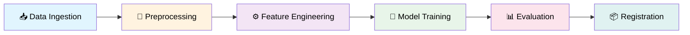

<div align="center">

# 🚀 MLflow Remote Tracking Pipeline

[](https://python.org)
[](https://mlflow.org)
[](https://dvc.org)
[](https://scikit-learn.org)

**An end-to-end MLOps pipeline for sentiment analysis with automated experiment tracking, model versioning, and registry management.**

</div>

---

## 📋 Overview

This project demonstrates a production-ready MLOps workflow using:

- **DVC** for data and pipeline versioning
- **MLflow** for experiment tracking, model logging, and model registry
- **Scikit-learn** for machine learning (BaggingClassifier with DecisionTree)

The pipeline processes text data, engineers Bag-of-Words features, trains a model, evaluates performance, and automatically registers improved models.

---

## 🏗️ Project Structure

```
MLflow/
├── 📂 data/
│   ├── raw/              # Original dataset
│   ├── interim/          # Train/test split
│   ├── processed/        # Cleaned & preprocessed
│   ├── features/         # Feature-engineered data
│   └── external/         # External resources (chat words dict)
│
├── 📂 src/
│   ├── data/
│   │   └── data_ingestion.py       # Data loading & splitting
│   ├── features/
│   │   ├── data_preprocessing.py   # Text cleaning & processing
│   │   └── feature_engineering.py  # Bag-of-Words vectorization
│   └── models/
│       ├── train_model.py          # Model training
│       ├── evaluate_model.py       # Evaluation & MLflow logging
│       └── register_model.py       # Model registry management
│
├── 📂 models/
│   ├── models/           # Trained model artifacts (.joblib)
│   └── vectorizers/      # Feature vectorizers (BoW)
│
├── 📂 mlartifacts/       # MLflow artifact storage
├── 📂 mlruns/            # MLflow run metadata
│
├── 📄 dvc.yaml           # DVC pipeline definition
├── 📄 dvc.lock           # DVC pipeline lock file
├── 📄 params.yaml        # Hyperparameters configuration
└── 📄 requirements.txt   # Python dependencies
```

---

## 🔄 Pipeline Stages

The DVC pipeline consists of **6 automated stages**:



| Stage | Script | Description |
|-------|--------|-------------|
| **Data Ingestion** | `data_ingestion.py` | Loads raw data and creates train/test split |
| **Preprocessing** | `data_preprocessing.py` | Cleans text, handles chat abbreviations |
| **Feature Engineering** | `feature_engineering.py` | Generates Bag-of-Words features |
| **Model Training** | `train_model.py` | Trains BaggingClassifier ensemble |
| **Evaluation** | `evaluate_model.py` | Computes metrics & logs to MLflow |
| **Registration** | `register_model.py` | Registers model if performance improves |

---

## ⚙️ Configuration

All hyperparameters are centralized in `params.yaml`:

```yaml
data_ingestion:
  seed: 42
  test_size: 0.2

feature_engineering:
  bow_max_features: 1000

model_training:
  estimator:
    criterion: "gini"
    max_depth: 7
    min_samples_split: 5
  bagging:
    n_estimators: 200
    max_samples: 0.85
```

---

## 🚀 Quick Start

### 1. Setup Environment

```bash
# Create virtual environment
python -m venv myenv
myenv\Scripts\activate  # Windows
# source myenv/bin/activate  # Linux/Mac

# Install dependencies
pip install -r requirements.txt
```

### 2. Start MLflow Server

```bash
mlflow server --host 127.0.0.1 --port 8080
```

### 3. Run the Pipeline

```bash
# Execute all stages
dvc repro

# Or run specific stage
dvc repro model_training
```

### 4. View Results

Open [http://127.0.0.1:8080](http://127.0.0.1:8080) in your browser to explore:
- 📈 Experiment metrics and parameters
- 📊 Confusion matrix and PR curves
- 📦 Registered model versions

---

## 📊 MLflow Tracking Features

| Feature | Description |
|---------|-------------|
| **Parameters** | All hyperparameters from `params.yaml` |
| **Metrics** | Accuracy, F1, Precision, Recall (per class) |
| **Artifacts** | Confusion matrix, PR curves, trained model |
| **Model Registry** | Version control with production aliases |

---

## 🔧 Key Commands

```bash
# Reproduce entire pipeline
dvc repro

# Check pipeline status
dvc status

# Push data to remote storage
dvc push

# View experiment in MLflow UI
mlflow ui --port 8080
```

---

## 📁 Data Flow

```
raw/train.csv
    ↓ [data_ingestion]
interim/{train,test}.csv
    ↓ [data_preprocessing]
processed/{train,test}.csv
    ↓ [feature_engineering]
features/{train,test}.csv + vectorizers/bow.joblib
    ↓ [model_training]
models/bagging_classifier.joblib
    ↓ [evaluate → register]
MLflow Model Registry
```

---

## 📝 License

This project is licensed under the terms specified in the [LICENSE](LICENSE) file.

---

<div align="center">

**Made with ❤️ for MLOps Learning**

</div>