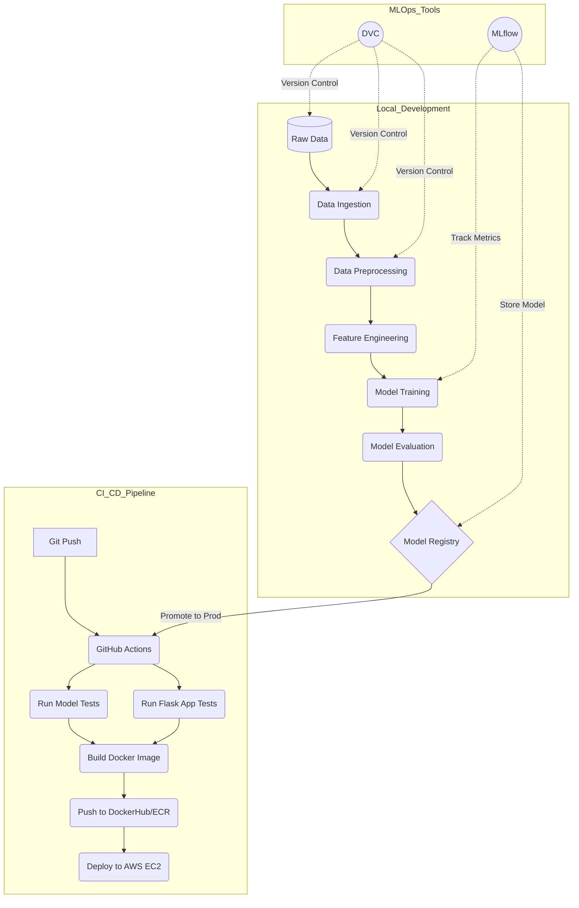

# Emotion Detection using MLOps Practices


A robust, production-ready machine learning project for detecting emotions from text. This project demonstrates a complete MLOps lifecycle, integrating Data Version Control (DVC), MLflow for experiment tracking and model registry, Docker for containerization, and a CI/CD pipeline using GitHub Actions and AWS.

---

## 🏗️ System Architecture

The following diagram illustrates the end-to-end MLOps pipeline designed for this project:



### 🔹 Pipeline Stages (DVC)
1.  **Data Ingestion**: Loads raw data and splits it into training and testing sets.
2.  **Data Preprocessing**: Cleans text data (lowercasing, removing HTML/links, stopword removal, lemmatization).
3.  **Feature Engineering**: Converts text to numerical features using a Bag-of-Words (BoW) vectorizer.
4.  **Model Training**: Trains a **Bagging Classifier** ensemble model.
5.  **Model Evaluation**: Evaluates the model using Accuracy, Precision, Recall, and F1-score.
6.  **Model Registration**: Registers the best-performing models to **MLflow Model Registry** locally or on **DagsHub**.

---

## ✨ Features
*   **End-to-End MLOps**: Fully automated pipeline from data ingestion to deployment.
*   **Experiment Tracking**: Uses **MLflow** to log parameters, metrics, and artifacts.
*   **Data Versioning**: Manages large datasets and pipeline stages with **DVC**.
*   **Reproducibility**: Ensures consistent results across different environments.
*   **Containerization**: Dockerized application for consistent deployment.
*   **CI/CD**: Automated testing and deployment with **GitHub Actions**.
*   **REST API**: Exposes the model via a **Flask** web application.

---

## 🛠️ Tech Stack
*   **Language**: Python 3.13
*   **Web Framework**: Flask
*   **Machine Learning**: Scikit-learn, NLTK, Pandas
*   **MLOps**: DVC, MLflow, DagsHub
*   **Containerization**: Docker
*   **CI/CD**: GitHub Actions
*   **Cloud Provider**: AWS (EC2, ECR, S3)

---

## 🚀 Getting Started

### Prerequisites
*   Python 3.13+
*   Docker
*   Git
*   DVC

### Installation

1.  **Clone the repository**:
    ```bash
    git clone https://github.com/Shriram-Vibhute/Emotion-Detection-MLOps-Practices.git
    cd Emotion-Detection-MLOps-Practices
    ```

2.  **Create and activate a virtual environment**:
    ```bash
    python -m venv myenv
    # Windows
    .\myenv\Scripts\activate
    # Linux/Mac
    source myenv/bin/activate
    ```

3.  **Install dependencies**:
    ```bash
    pip install -r requirements.txt
    ```

4.  **Pull data from DVC**:
    ```bash
    dvc pull
    ```

5.  **Set up Environment Variables**:
    Create a `.env` file in the root directory and add your DagsHub token:
    ```bash
    DAGSHUB_PAT=your_dagshub_token
    ```

---

## 🖥️ Usage

### Running Locally (Flask App)
To run the web application on your local machine:
```bash
python app/app.py
```
Access the app at `http://localhost:5000`.

### Running with Docker
1.  **Build the image**:
    ```bash
    docker build -t emotion-detection .
    ```
2.  **Run the container**:
    ```bash
    docker run -p 5000:5000 -e DAGSHUB_PAT=your_token emotion-detection
    ```

### Reproducing the Pipeline (DVC)
To run the entire machine learning pipeline (Ingestion -> Evaluation):
```bash
dvc repro
```

---

## 📂 Project Structure

```text
├── .dvc/                  # DVC configuration files
├── .github/workflows/     # CI/CD pipelines
├── app/                   # Flask application source code
│   ├── templates/         # HTML templates
│   ├── app.py             # Main application entry point
│   └── preprocessing.py   # Text preprocessing logic
├── data/                  # Data directory (managed by DVC)
│   ├── external/          # External dictionaries (chat words)
│   ├── raw/               # Original immutable data
│   ├── interim/           # Intermediate data
│   ├── processed/         # Cleaned data
│   └── features/          # Feature engineered data
├── deploy/                # Deployment scripts (AWS CodeDeploy)
├── models/                # Trained models and vectorizers
├── notebooks/             # Jupyter notebooks for experimentation
├── src/                   # Source code for ML pipeline
│   ├── data/              # Data ingestion scripts
│   ├── features/          # Preprocessing & feature engineering
│   └── models/            # Training & evaluation scripts
├── tests/                 # Unit tests
├── dvc.yaml               # DVC pipeline definition
├── params.yaml            # Hyperparameters and configuration
└── requirements.txt       # Project dependencies
```

---

## 🤝 Contributing
Contributions are welcome! Please open an issue or submit a pull request for any improvements or bug fixes.

## 📄 License
This project is licensed under the MIT License - see the `LICENSE` file for details.
